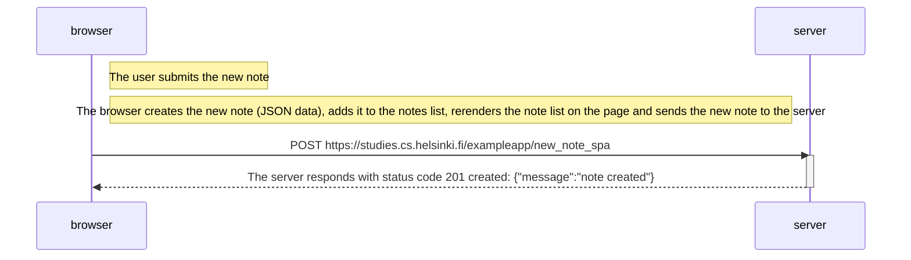

```mermaid
sequenceDiagram
    participant browser
    participant server

    Note right of browser: The user submits the new note

    Note right of browser: The browser creates the new note (JSON data), adds it to the notes list, rerenders the note list on the page and sends the new note to the server

    browser->>server: POST https://studies.cs.helsinki.fi/exampleapp/new_note_spa
    activate server
    server-->>browser: The server responds with status code 201 created: {"message":"note created"}
    deactivate server
```